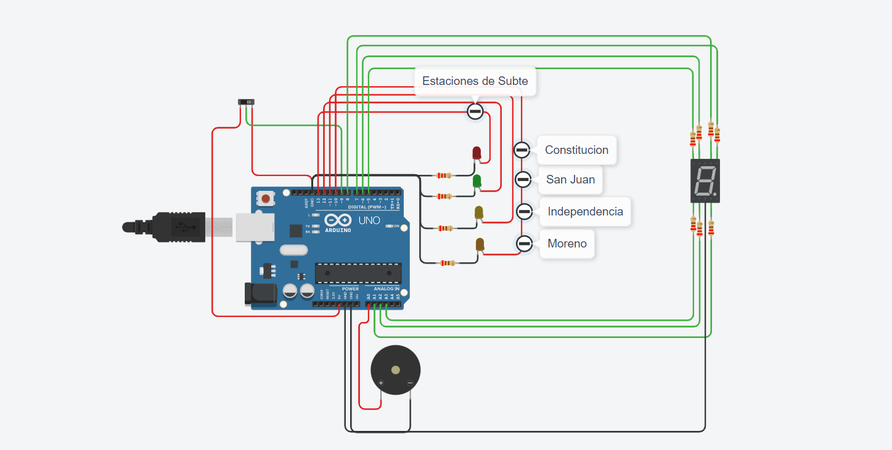

# Ejercicio Estación del Subte

## Integrantes 
- Julio C. Barrios C.

## Proyecto: Contador binario.

## Descripción
Este proyecto simula y notifica las paradas del subte, encendiendo un led de
color, emitiendo un sonido mediante un buzzer y el numero de estación en una pantalla de 7 segmentos. Puede ser encendido y apagado mediante el switch.

## Función principal
La funcion se encarga de controlar los led, numero de estacion y sonido que emite el buzzer por estacion.

**encender**: es la variable que recibe el estado del switch.  
**tiempo_estacion**: define el tiempo que estara en cada estacion.  
**tono_frecuencia**: especifica el tono de frecuencia que tendra el sonido.  
**tono_duracion**: establece el tiempo que el sonido emitido tendra.

Segun el estado del switch y del contador que representa cada una de las estaciones, enciende las luces y emite los sonidos correspondientes a cada una de ellas mediante la estructura de control if else y condicionales. Tambien imprime la estacion actual en la consola.

~~~ C (c++)
void estaciones(int encender, int tiempo_estacion, int tono_frecuencia, int tono_duracion) {
  	int contador = 0;
  
	if (encender == 0){
    digitalWrite(LED1,LOW);
    digitalWrite(LED2,LOW);
    digitalWrite(LED3,LOW);
    digitalWrite(LED4,LOW);
    digitalWrite(A,LOW);
    digitalWrite(B,LOW);
    digitalWrite(C,LOW);
    digitalWrite(D,LOW);
    digitalWrite(E,LOW);
    digitalWrite(F,LOW);
    digitalWrite(G,LOW);

    } else {
      if (contador == 0){
        digitalWrite(LED4,LOW);
        digitalWrite(LED1,HIGH);
        encenderNumero(contador);
        contador++;
        tone(PIEZO, tono_frecuencia, tono_duracion);
        Serial.println("Estacion: Constitucion");
        delay(tiempo_estacion);
    }
      if (contador == 1){
        digitalWrite(LED2,HIGH);
        digitalWrite(LED1,LOW);
        encenderNumero(contador);
        Serial.println("Estacion: San Juan");
        contador++;
        tone(PIEZO, tono_frecuencia, tono_duracion);
        delay(tiempo_estacion);
    }
      if (contador == 2){
        digitalWrite(LED3,HIGH);
        digitalWrite(LED2,LOW);
        encenderNumero(contador);
        Serial.println("Estacion: Independencia");
        contador++;
        tone(PIEZO, tono_frecuencia, tono_duracion);
        delay(tiempo_estacion);
    }
       if (contador == 3){
         digitalWrite(LED4,HIGH);
         digitalWrite(LED3,LOW);
         encenderNumero(contador);
         Serial.println("Estacion: Moreno");
         contador = 0;
         tone(PIEZO, tono_frecuencia, tono_duracion);
         delay(tiempo_estacion);
    }
    }
~~~

## :robot: Link al proyecto
- [proyecto](https://www.tinkercad.com/things/dL8MiSzpDID)
## :tv: Link al video del proceso
- [video](https://www.youtube.com/watch?v=VyGjE8kx-O0)

---
### Fuentes
- [Consejos para documentar](https://www.sohamkamani.com/how-to-write-good-documentation/#architecture-documentation).

- [Lenguaje Markdown](https://markdown.es/sintaxis-markdown/#linkauto).

- [Markdown Cheatsheet](https://github.com/adam-p/markdown-here/wiki/Markdown-Cheatsheet).

- [Tutorial](https://www.youtube.com/watch?v=oxaH9CFpeEE).

- [Emojis](https://gist.github.com/rxaviers/7360908).

---

